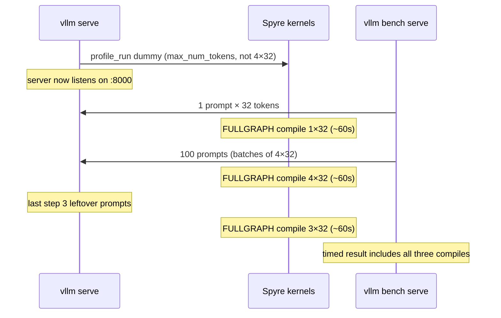
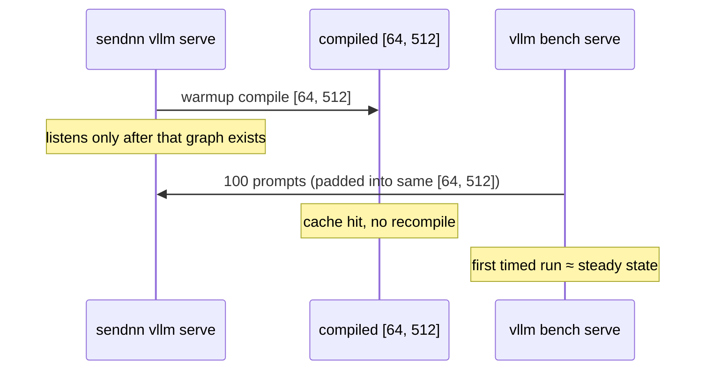

# Encoder warmup vs first bench (why sendnn is fast on “try 1”)

This page explains one serving puzzle:

- **First** `vllm bench serve` after `vllm serve` is slow (tens of seconds, or minutes with `--compilation-config`).
- **Second** bench on the **same** server is fast.
- **sendnn-inference** looks fast on the first bench.

Nothing is “broken” on the second run. The first run is **building kernels for new tensor shapes**. Sendnn builds the **serve shape** during `vllm serve`, before any client request. Spyre-inference warmup follows upstream `profile_run()` (`_dummy_run(max_num_tokens)`), which is usually **not** the bench’s 4×32, so the bench can still pay compile.

All numbers below are Granite-125m CLS, 100 prompts × 32 tokens, `max_num_seqs=4`, `/v1/embeddings`, `--request-rate inf`.

---

## 1. A “shape” is a exact size, not “about 32 tokens”

Spyre (and `torch.compile(..., dynamic=False)`) specialize kernels on **static sizes**. Two forwards that look the same to you are different programs to the compiler:

| Forward | Sequences (B) | Tokens per seq (T) | Packed attention length | New kernel set? |
|---|---|---|---|---|
| Serve dummy (`profile_run`) | `max_num_seqs` | `max_num_tokens / max_num_seqs` (often 2048) | padded to stick | built at startup |
| Bench client probe | **1** | **32** | 64 | **yes — first bench** |
| Bench main load | **4** | **32** | 64 | **yes — first bench** |
| Bench leftover | **3** | **32** | 64 | **yes — first bench** |

`profile_run` dummies **`max_num_tokens`** (usually `max_num_batched_tokens`, often 8192) split across `max_num_seqs`. With `max_num_seqs=4` that is **4×2048**, not **4×32**. The compiler does not reuse that dummy for the bench.

Padding seq length to 64 (stick alignment) does **not** make a 4×2048 dummy equal a 4×32 bench. Batch size and token count still differ (`1` vs `4` vs `3`).

---

## 2. Two compiles (easy to mix up)

| | When vLLM compile is **off** (default serve) | When you pass `STOCK_TORCH_COMPILE` |
|---|---|---|
| What compiles | Each Spyre **aten op**, per shape (`dynamic=False`) | The **whole model** as one graph (`fullgraph=True`), **plus** per-op compile |
| Cost of a new shape | Seconds (eager first bench ~40 s) | ~60 s **per** new `(B, T)` (first bench ~256 s) |
| Need it to use the card? | **No** — weights already on `spyre` | **No** for spyre-inference. **Yes** for sendnn (`backend="sendnn"`) |

Default `vllm serve` logs `Compilation disabled` **and** can still spend ~15 s in dummy warmup labeled `compilation: …`. That is torch-spyre specializing **ops**, not vLLM `STOCK_TORCH_COMPILE`.

---

## 3. Worked example: same 100 requests, two tries

### Spyre-inference (eager, default)

Serve warmup is upstream `profile_run` (`_dummy_run(max_num_tokens)`, often 4×2048). Then:

```
vllm bench serve ... --num-prompts 100 --random-input-len 32 --request-rate inf
```

**Try 1 (cold shapes 1×32, 4×32, 3×32):**

| | Duration | req/s |
|---|---|---|
| First bench | 42 s | 2.4 |

**Try 2 (same server, kernels already cached):**

| | Duration | req/s |
|---|---|---|
| Second bench | ~2 s | ~47 |

### Spyre-inference (`STOCK_TORCH_COMPILE`)

Same `profile_run` dummy at startup. First bench rebuilds a **full graph** for 1×32, then 4×32, then 3×32. Engine log:

```text
No available shared memory broadcast block found in 60 seconds.
This typically happens when some processes are hanging or doing some
time-consuming work (e.g. compilation, ...)
```

That hang appears **three times** (probe, main batch, tail of 3).

| | Duration | req/s |
|---|---|---|
| First bench | 256 s | 0.39 |
| Second bench | 1.5 s | **65** |

Compile **does** help the plateau (65 vs 47). It does **not** move that cost to startup, because warmup still is not 4×32.

### Timeline (compile-on, first bench)



Second bench: 1×32, 4×32, 3×32 already exist → ~65 req/s.

---

## 4. Why sendnn looks fast on “try 1”

Sendnn pooling is a **static padded BERT**, not a varlen vLLM attention backend.

At **serve startup** (before the client runs):

```bash
export SENDNN_INFERENCE_WARMUP_PROMPT_LENS=512
export SENDNN_INFERENCE_WARMUP_BATCH_SIZES=64
# default: SENDNN_INFERENCE_DYNAMO_BACKEND=sendnn
vllm serve ibm-granite/granite-embedding-125m-english --runner pooling --port 8000
```

That compiles **one** graph:

```text
model(input_ids, attention_mask)   # left-padded [64, 512]
```

`torch.compile(..., backend="sendnn", dynamic=False)` is also how sendnn **places work on Spyre**. `SENDNN_INFERENCE_DYNAMO_BACKEND=eager` skips compile **and** the card (CPU HuggingFace). That debug path is **not** a Spyre baseline.

Every embed request is padded to the warmed `[B, L]`. The first bench does **not** introduce 1×32 / 4×32 / 3×32 graphs. Startup was slow; the **bench clock** never saw it.



| | When the expensive compile runs | First bench |
|---|---|---|
| sendnn | During `vllm serve` (shape = serve shape) | Fast (already warm) |
| spyre-inference today | `profile_run` dummy at serve (`max_num_tokens`), **real 32-token shapes during first bench** | Slow |

---

## 5. Gather-pack vs old encoder pack (separate from warmup)

Once both sides are **warm 2nd benches**, gather-pack (on-device `index_select`) vs the old CPU scatter path:

| Warm 2nd bench | req/s | Duration |
|---|---|---|
| Before (CPU scatter) | 5.7 | 17.5 s |
| After (gather-pack, eager) | ~47 | ~2 s |
| After (gather-pack + `STOCK_TORCH_COMPILE`) | ~65 | 1.5 s |

That **~8×** (eager) is the encoder-pack change. The 1st-vs-2nd cliff is **shape compile**, not pack vs scatter.

Do not compare a **cold** gather-pack first bench (2.4 req/s) to a **warm** old-path second bench (5.7 req/s).

---

## 6. How to measure

1. Start serve once. Wait until it is listening.
2. Run the bench **twice**. Quote the **second** result.
3. Optional: `--num-warmups 1` on the client so the probe is outside the timed window (the 4×32 / 3×32 compiles can still land in try 1 if those shapes were never warmed).

```bash
export VLLM_PLUGINS=spyre_inference

vllm serve ibm-granite/granite-embedding-125m-english \
  --runner pooling --port 8000 --max-num-seqs 4

# After the server is up — run twice; keep the second:
vllm bench serve \
  --backend openai-embeddings \
  --base-url http://127.0.0.1:8000 \
  --model ibm-granite/granite-embedding-125m-english \
  --endpoint /v1/embeddings \
  --dataset-name random \
  --num-prompts 100 \
  --random-input-len 32 \
  --request-rate inf
```

Whole-model compile (optional, **not** sendnn’s backend; encoder first-try still cold unless the dummy matches 32-token bench shapes):

```bash
vllm serve ibm-granite/granite-embedding-125m-english \
  --runner pooling --port 8000 --max-num-seqs 4 \
  --compilation-config '{"mode":"STOCK_TORCH_COMPILE"}'
```

Do **not** pass `--enforce-eager` with that flag. Worker log should say `Compiled model ... as a single graph`, not `Compilation disabled`.

---

## 7. `profile_run` plus serve-shape dummies

`warming_up_model` still starts with upstream `profile_run()` (`_dummy_run(max_num_tokens)`).
Spyre then dummies **1×32** and **`max_num_seqs`×32** so the first 32-token bench is a
cache hit. Override with `SPYRE_WARMUP_PROMPT_LENS` / `SPYRE_WARMUP_BATCH_SIZES`
(e.g. `1,36,64` for 100 prompts at `--max-num-seqs 64`).

Startup is slower (compile happens here). The first `vllm bench serve` should match
the old second run, except leftover batch sizes you did not list.

---

## See also

- [Configuration](configuration.md)
- [Encoder remaining CPU / device limits](../architecture/encoder-remaining-cpu.md)
- `spyre_inference/v1/worker/spyre_model_runner.py` (`profile_run` + pooling `B×T` dummies)
- `spyre_inference/platform.py` (`CompilationMode.NONE` when mode is unset)
